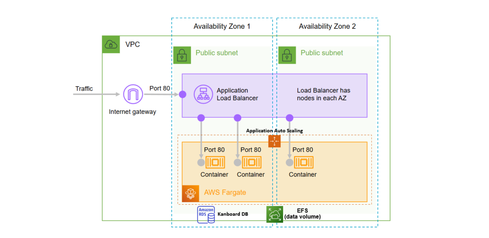
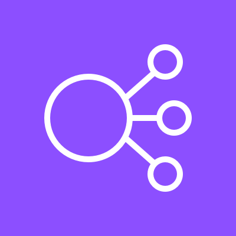
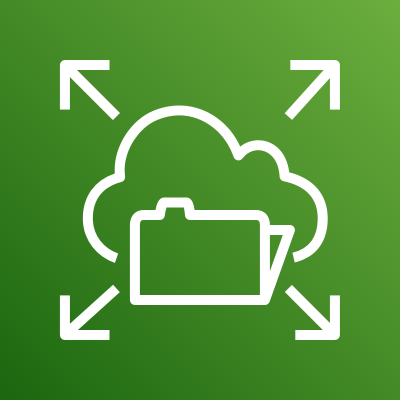
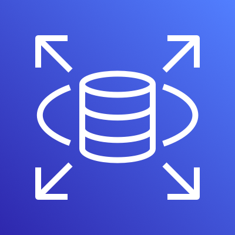
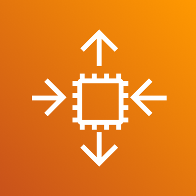
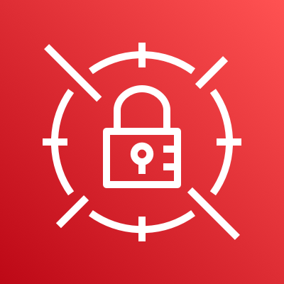

# Architecture

## Component Diagram

## Services used

| Service | Role |
|---|---|
|  **ECS Fargate** | Serverless container orchestration — runs Kanboard and PHPMyAdmin tasks |
|  **Application Load Balancer** | Distributes traffic across tasks; exposes ports 80 (Kanboard) and 8080 (PHPMyAdmin) |
|  **EFS** | Persistent shared filesystem for Kanboard file attachments across all tasks |
|  **RDS MySQL** | Persistent relational database for all Kanboard project/board data |
|  **Application Auto Scaling** | Scales ECS tasks between 2–8 based on average CPU utilization (target: 50%) |
|  **Secrets Manager** | Stores DATABASE_URL and PMA_HOST securely, injected into containers at runtime |
|  **ACM** | TLS certificate for HTTPS on the load balancer |
|  **CloudWatch / Container Insights** | Monitoring and alerting for CPU, network, and request metrics |
|  **VPC / Security Groups** | Network isolation — traffic flows strictly through the load balancer |

## Security Group Rules Summary

| Security Group | Allows | From |
|---|---|---|
| GS-ALB-Kanboard | HTTP 80, HTTPS 443, 8080, 8443 | 0.0.0.0/0 |
| GS-KANBOARD-SERVICE | HTTP 80 | GS-ALB-Kanboard only |
| GS-EFS-KANBOARD | NFS 2049 | GS-KANBOARD-SERVICE only |
| GS-RDS-KANBOARD | MySQL 3306 | GS-KANBOARD-SERVICE only |

## Data Flow

1. Client sends HTTP request to ALB DNS name
2. ALB forwards to a healthy Kanboard task (round-robin)
3. Kanboard task reads/writes project data to RDS MySQL
4. File attachments are read/written to the shared EFS volume
5. All tasks share the same EFS and RDS → data is consistent regardless of which task handles the request

## Security Notes

- Containers are only reachable through the ALB (direct IP access is blocked by security groups)
- Sensitive environment variables (DATABASE_URL, PMA_HOST) are stored in AWS Secrets Manager
- EFS uses transit encryption
- In production: enable RDS Multi-AZ, automated backups, and encryption at rest

## Why Public Subnets for Tasks?

In a production architecture, ECS tasks would run in private subnets with a NAT Gateway for outbound internet access (to pull Docker images). This adds ~$64/month for two NAT Gateways (one per AZ for HA).

For this lab, tasks run in public subnets with a public IP to avoid that cost. The security groups ensure that only the ALB can send inbound traffic to the tasks — the public IP is only used for outbound Docker Hub pulls.