# Step-by-Step Deployment Guide

Complete walkthrough of deploying Kanboard on AWS ECS with high availability.

---

## Overview

The deployment is built incrementally in 9 steps:

1. Basic ECS deployment (no persistence)
2. Create EFS volume
3. Create RDS database
4. Test EFS mount and prepare the database
5. Add persistence to the ECS task
6. Add high availability (ALB + auto scaling)
7. Stress test with Siege
8. Add PHPMyAdmin service
9. Secure secrets with Secrets Manager
10. Enable HTTPS

---

## Step 1 — Basic Deployment (No Persistence)

**Why:** Before adding storage complexity, verify the Kanboard container runs correctly on ECS.

### Create ECS Cluster
- Name: `KanboardCluster`
- Infrastructure: AWS Fargate
- Enable Container Insights (enhanced observability)

> If cluster creation fails, exit and re-enter ECS console. The `AWSServiceRoleForECS` role is created on first console access and may not exist yet.

### Create Task Definition
- Family: `kanboard-task`
- CPU: 0.25 vCPU / Memory: 0.5 GB
- Task role + execution role: `LabRole`
- Container: image `kanboard/kanboard`, port 80 HTTP

### Deploy Service
- Service name: `kanboard-service`
- Desired tasks: 1
- New SG `GS-KANBOARD-SERVICE`: inbound HTTP from Anywhere
- Public IP: ON (needed to pull image from Docker Hub)

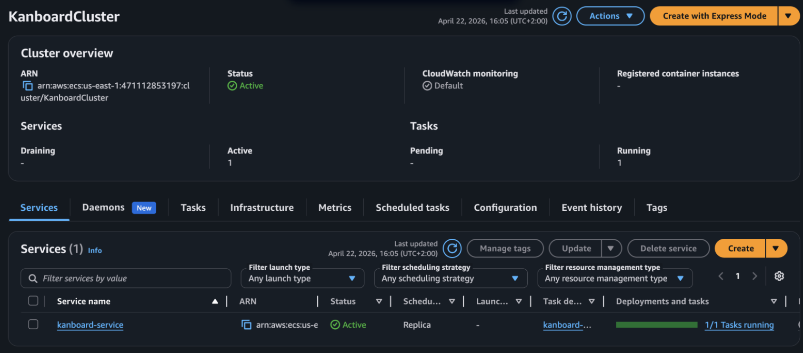

**Verify:** Get the task's public IP → open `http://<IP>` → login with `admin/admin`. Create a project and task. Then stop the task — ECS will relaunch it, and all data will be gone. This confirms containers are stateless by default.

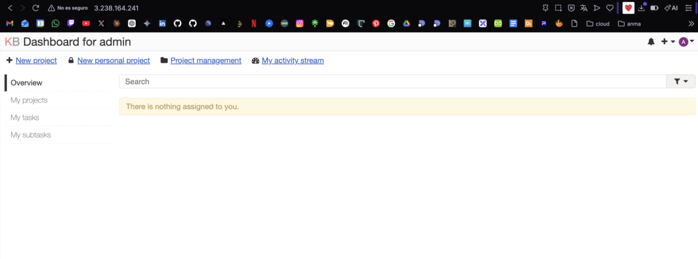

---

## Step 2 — Create EFS Volume

**Why:** Kanboard stores file attachments (uploaded files, screenshots) on disk at `/var/www/app/data`. Without a shared persistent volume, each container has its own ephemeral disk and data is lost on restart. EFS provides a shared NFS filesystem accessible by all ECS tasks across AZs.

### Security Group for EFS
- Name: `GS-EFS-KANBOARD`
- Inbound: NFS (port 2049), source: `GS-KANBOARD-SERVICE`

This restricts EFS access to only the Kanboard containers.

### Create EFS Filesystem
- Name: `KanboardEFS`
- Type: Regional (replicated across AZs)
- Backups: OFF (lab cost saving)
- Encryption at rest: OFF (lab; enable in production)
- Throughput: Bursting
- Mount targets: us-east-1a and us-east-1b, SG: `GS-EFS-KANBOARD`

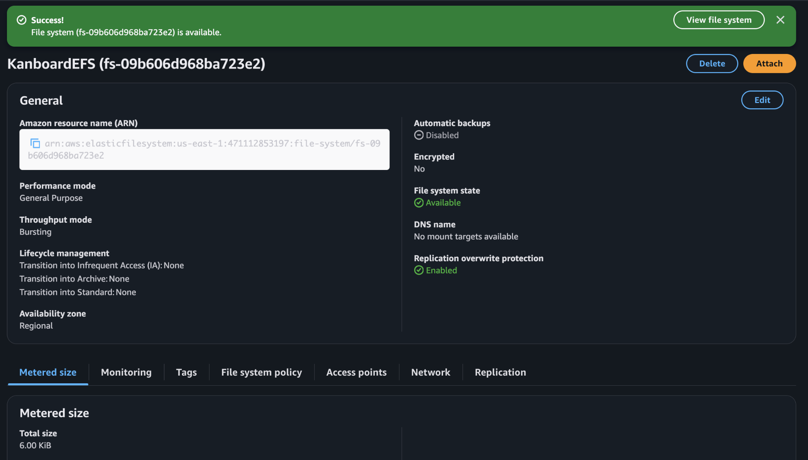

---

## Step 3 — Create RDS MySQL Database

**Why:** Kanboard defaults to SQLite (a local file DB). With multiple ECS tasks running simultaneously, they cannot all share a single SQLite file. RDS MySQL provides a centralized, shared database that all tasks connect to via network.

- Engine: MySQL
- Template: Dev/Test
- Identifier: `KanboardDB`
- Instance: db.t3.micro (burstable)
- Storage: 20 GiB gp3
- New SG `GS-RDS-KANBOARD`: inbound MySQL (3306) from `GS-KANBOARD-SERVICE`
- Public access: NO
- Backups, encryption: OFF (lab)

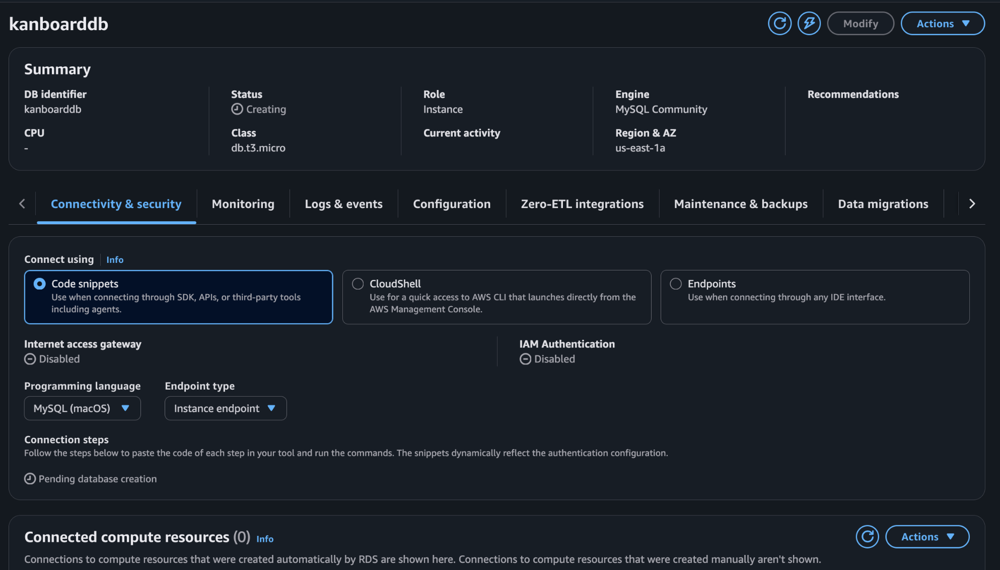

---

## Step 4 — Mount EFS and Prepare the Database

**Why:** Before connecting ECS to these storage services, we verify they work correctly from an EC2 instance.

### EC2 Security Group requirements
- EC2 SG: inbound SSH from Anywhere
- `GS-RDS-KANBOARD`: add inbound MySQL from EC2 SG
- `GS-EFS-KANBOARD`: add inbound NFS from EC2 SG

### Mount EFS
```bash
sudo apt update && sudo apt install -y nfs-common
sudo mkdir /mnt/efs
sudo mount -t nfs4 -o nfsvers=4.1,rsize=1048576,wsize=1048576,hard,timeo=600,retrans=2,noresvport \
  fs-XXXXXXXX.efs.us-east-1.amazonaws.com:/ /mnt/efs
df -hT
sudo touch /mnt/efs/test.txt && sudo rm /mnt/efs/test.txt
```

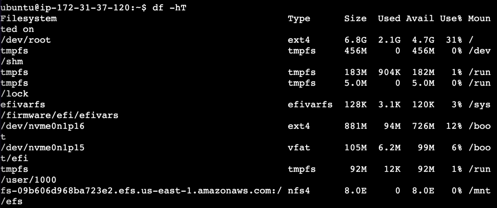

### Prepare MySQL
```bash
sudo apt install -y mysql-client
mysql -h <RDS-ENDPOINT> -u admin -p
```
```sql
CREATE DATABASE kanboard CHARACTER SET utf8mb4 COLLATE utf8mb4_unicode_ci;
CREATE USER kanboard@'%' IDENTIFIED BY 'mypassword';
GRANT ALL ON kanboard.* TO kanboard@'%';
FLUSH PRIVILEGES;
SHOW DATABASES;
SELECT host, user FROM mysql.user;
QUIT;
```

---

## Step 5 — Add Persistence to the Task

**Why:** Now we connect the task to both storage backends by updating the task definition.

### New task revision
In `kanboard-task`, create new revision:

**Environment variable:**
- Key: `DATABASE_URL`
- Value: `mysql://kanboard:mypassword@<RDS-ENDPOINT>/kanboard`

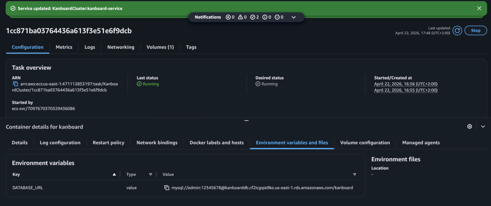

**EFS Volume:**
- Volume name: `kanboard-data`
- Type: EFS
- File system: `KanboardEFS`
- Enable transit encryption
- Mount point in container: `/var/www/app/data`

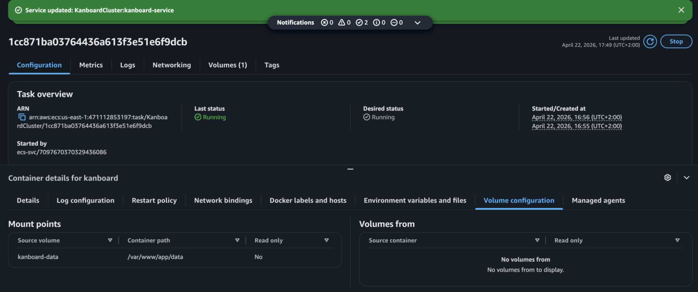

Update `kanboard-service` to use revision 2. Wait for new task to reach Running state.

**Verify persistence:**
1. Login to Kanboard, change admin password, create a personal user
2. Create a project with tasks and file attachments
3. Stop the task from AWS console
4. ECS launches a new task — login again
5. All data should still be there ✓

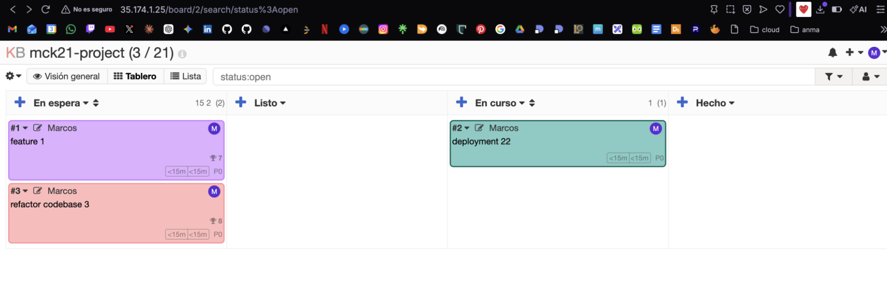

---

## Step 6 — High Availability: ALB + Auto Scaling

**Why:** A single task is a single point of failure. The ALB distributes traffic across multiple tasks in different AZs. Auto scaling ensures capacity grows with load and shrinks when idle, optimizing cost.

### Delete old service
Remove `kanboard-service` before creating the HA version.

### New service: `kanboard-ha-service`
- Desired tasks: **2** (one per AZ)
- Health check grace period: 120s (gives Kanboard time to start)
- ALB: `Kanboard-ALB`, listener port 80, target group `Kanboard-TG`
- Auto scaling: min 2, max 8, CPU target tracking at 50%

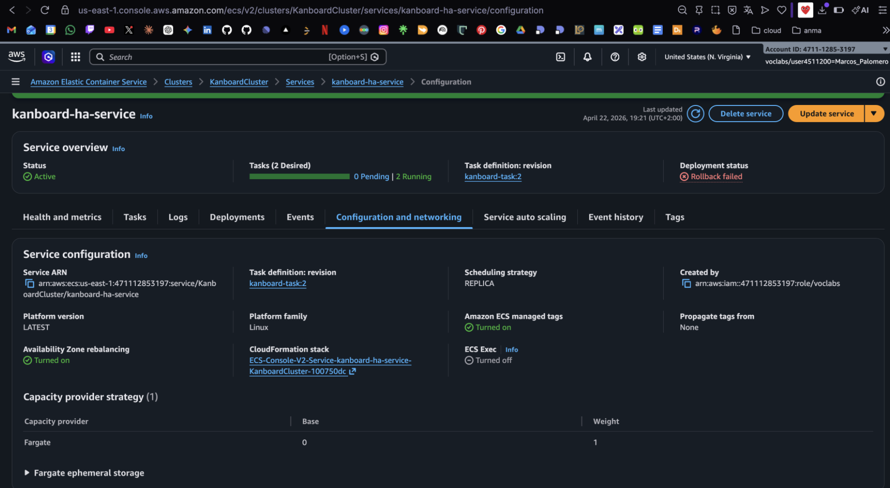

### Fix health checks
Kanboard redirects `/` to `/login` with HTTP 302. The default ALB health check only accepts 200.

EC2 → Target Groups → Kanboard-TG → Health checks → Edit → Success codes: `200,302`

### Restrict access to ALB only
- New SG `GS-ALB-Kanboard`: HTTP 80 from Anywhere → assign to ALB
- Edit `GS-KANBOARD-SERVICE`: change HTTP source from Anywhere to `GS-ALB-Kanboard`

Now direct task IP access is blocked; only the ALB can reach the containers.

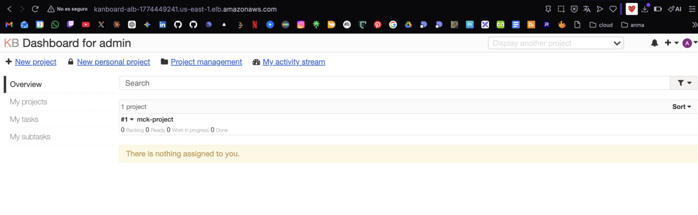

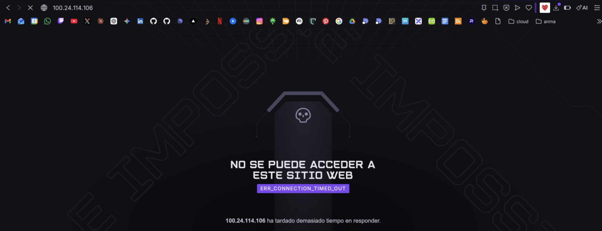

---

## Step 7 — Stress Test with Siege

**Why:** Verify the auto scaling policy actually triggers under real load.

```bash
sudo apt install siege -y
siege -c 50 -t 600S -delay 0.1 http://<ALB-DNS-NAME>
```

Monitor in AWS:
- ECS → Tasks: watch count go from 2 → up to 8
- CloudWatch → Container Insights: CPU utilization graph
- EC2 → Load Balancers → Monitoring: requests/connections graph

Expected behavior:
1. CPU rises above 50% → CloudWatch alarm triggers
2. ECS scales out new tasks
3. CPU drops as load is distributed
4. After siege ends, CPU falls → ECS scales back to minimum 2 tasks

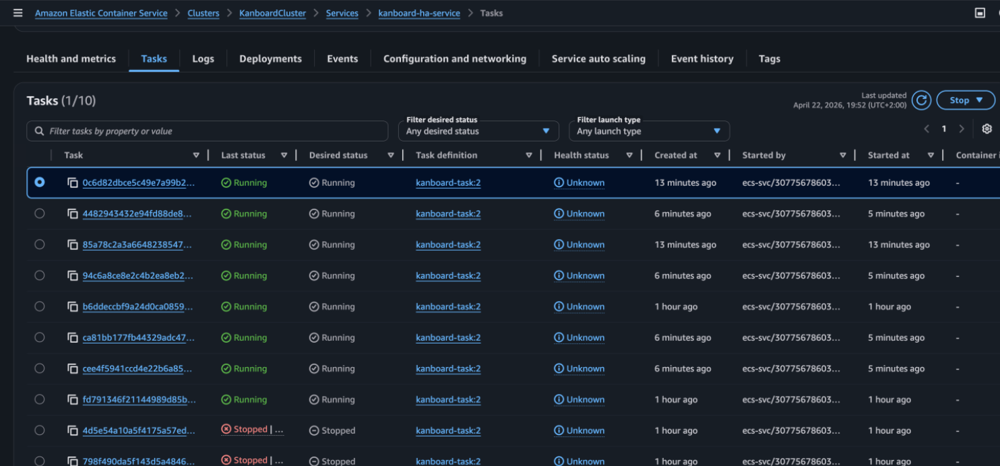

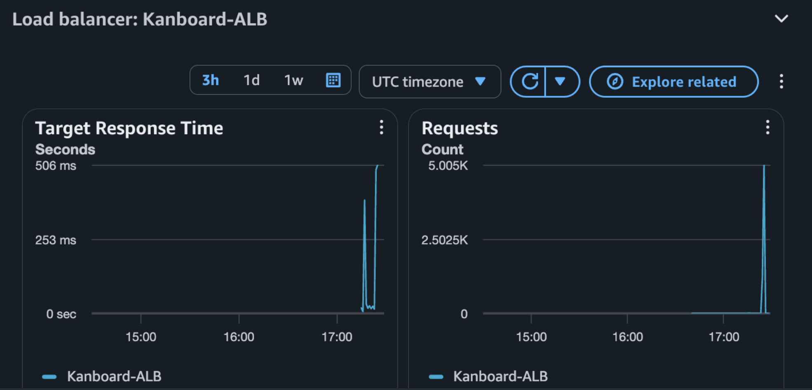

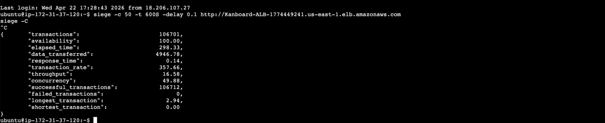

---

## Step 8 — Add PHPMyAdmin Service

**Why:** PHPMyAdmin provides a web UI for database administration without needing to SSH into an EC2 instance and use the CLI.

### New task definition
- Image: `phpmyadmin` (Docker Hub)
- Port: 80
- Env var: `PMA_HOST` = `<RDS-ENDPOINT>`

### New service
- Desired tasks: 1 (admin tool, no auto scaling needed)
- Same ALB (`Kanboard-ALB`)
- New listener: port **8080**
- New target group: `PHPMyAdmin-TG`

Add inbound rule to `GS-ALB-Kanboard` for port 8080.

Access via: `http://<ALB-DNS>:8080`
Login with `kanboard` / `mypassword` or `admin` / `<your-rds-password>`

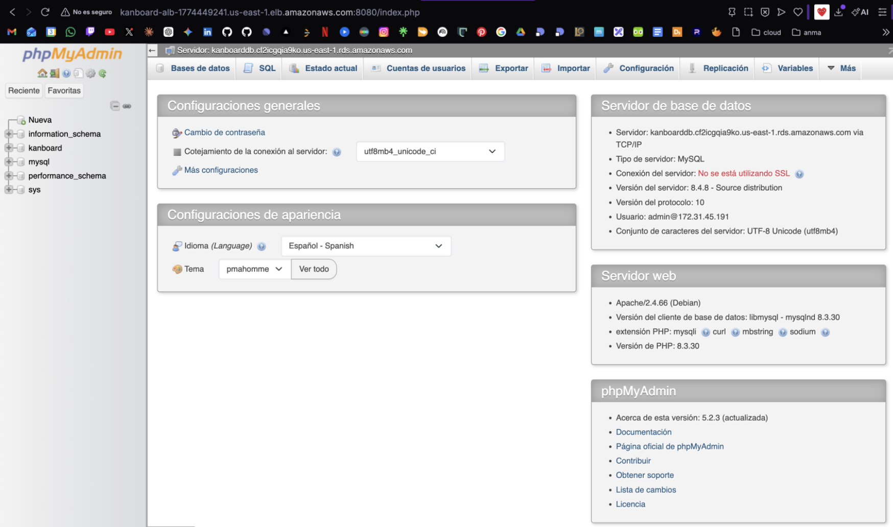

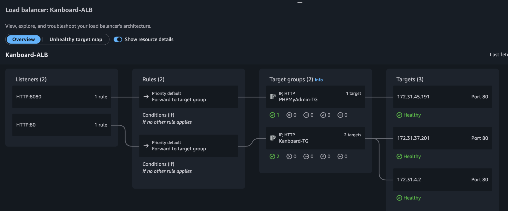

---

## Step 9 — Secrets Manager

**Why:** Storing sensitive values like database connection strings directly in task definitions is a security risk — they appear in plaintext in the ECS console and CloudTrail logs. Secrets Manager encrypts them at rest and injects them at container startup.

### Create secret
- Secrets Manager → Store new secret → Other type
- Add two key/value pairs:
  - `DATABASE_URL` → `mysql://kanboard:mypassword@<endpoint>/kanboard`
  - `PMA_HOST` → `<endpoint>`
- Secret name: `kanboard/secrets`

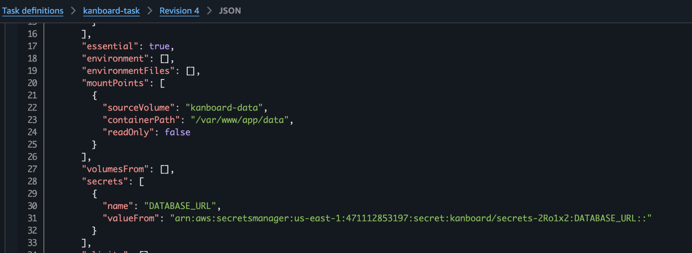

### Update task definitions
In each task definition's environment variable section, change type from **Value** to **ValueFrom**:

```json
"secrets": [
  {
    "name": "DATABASE_URL",
    "valueFrom": "arn:aws:secretsmanager:us-east-1:ACCOUNT:secret:kanboard/secrets-XXXXX:DATABASE_URL::"
  }
]
```

Note the format: `full-secret-ARN:key-name::` (two colons at the end).

Update both services with the new task revisions.

---

## Step 10 (Optional) — HTTPS

### Generate self-signed certificate
```bash
openssl req -x509 -nodes -days 365 -newkey rsa:2048 \
  -keyout kanboard.key -out kanboard.crt \
  -subj "/C=ES/ST=Valencia/L=Valencia/O=IES/CN=*.us-east-1.elb.amazonaws.com"
```

### Import into ACM
ACM → Import certificate → paste contents of `kanboard.crt` and `kanboard.key`

### Add HTTPS listener to ALB
- Port 443, HTTPS, forward to `Kanboard-TG`, select imported cert
- Add port 8443 for PHPMyAdmin if desired

### Update security group
Add HTTPS (443) inbound rule to `GS-ALB-Kanboard`.

### Optional: redirect HTTP to HTTPS
ALB → Listener HTTP:80 → Edit → Action: Redirect to HTTPS 443

> Browser will show a certificate warning for self-signed certs. In Chrome, type `thisisunsafe` on the warning page to proceed.

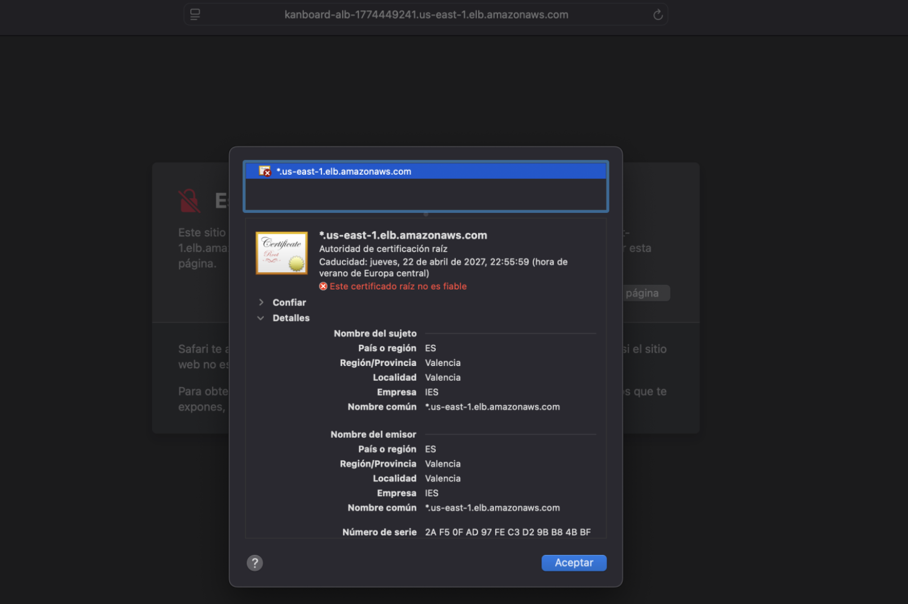

---

## Cleanup

Delete resources in this order to avoid dependency errors:

1. ECS Services → ECS Cluster
2. ALB → Target Groups
3. RDS instance
4. EFS filesystem
5. Secrets Manager secret
6. EC2 instance
7. Security Groups
8. CloudFormation stacks (if used)